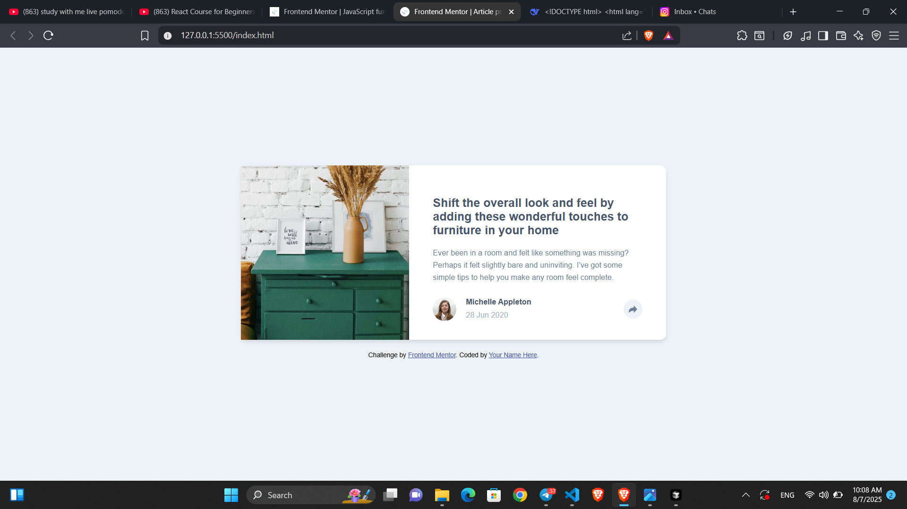
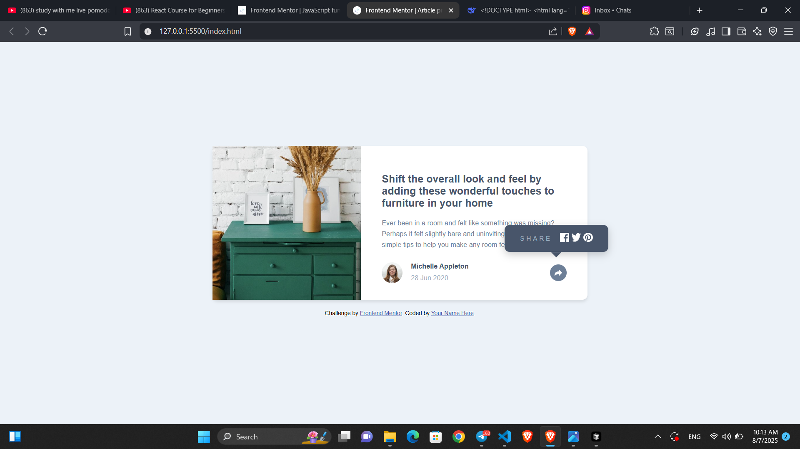

# Frontend Mentor - Article preview component solution

This is a solution to the [Article preview component challenge on Frontend Mentor](https://www.frontendmentor.io/challenges/article-preview-component-dYBN_pYFT). Frontend Mentor challenges help you improve your coding skills by building realistic projects. 

## Table of contents

  - [Overview](#overview)
  - [The challenge](#the-challenge)
  - [Screenshot](#screenshot)
  - [Links](#links)
  - [My process](#my-process)
  - [Built with](#built-with)
  - [What I learned](#what-i-learned)
  - [Author](#author)

**Note: Delete this note and update the table of contents based on what sections you keep.**

## Overview
It is a simple article website made by HTML,CSS and JS with share links option 
### The challenge

Users should be able to:

- View the optimal layout for the component depending on their device's screen size
- See the social media share links when they click the share icon

### Screenshot

### Links

- Solution URL: (https://github.com/ShemaTZ/article-preview)
- Live Site URL: (https://article-preview-psi-ecru.vercel.app/)

## My process
First I decided what to use in html I created h3,p and div elements and gave them class name then I created style file and styled the whole page after that I created js file and added the functionality there
### Built with

- Semantic HTML5 markup
- CSS custom properties
- Flexbox
- CSS Grid
- Mobile-first workflow

### What I learned

I learned how to add interactivity using Javascript

## Author

- Frontend Mentor - [@ShemaTZ](https://www.frontendmentor.io/profile/ShemaTZ)
- Instagram - [@siket_tz](https://ww.instagram.com/siket_tz)

